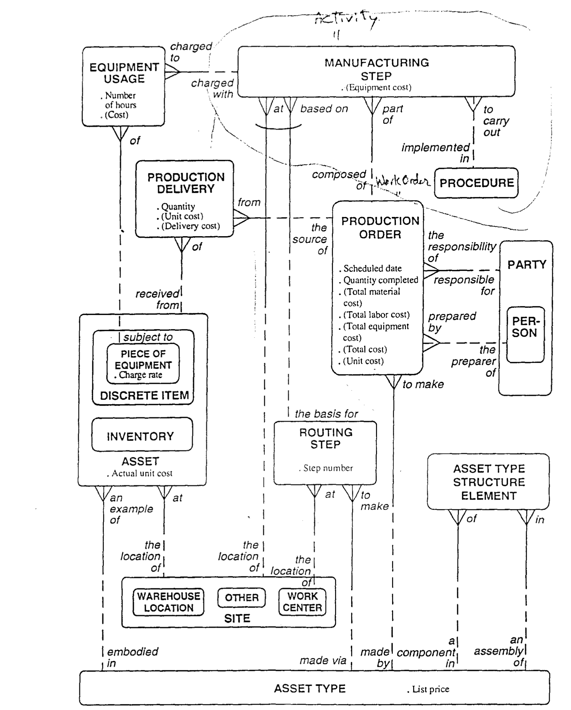
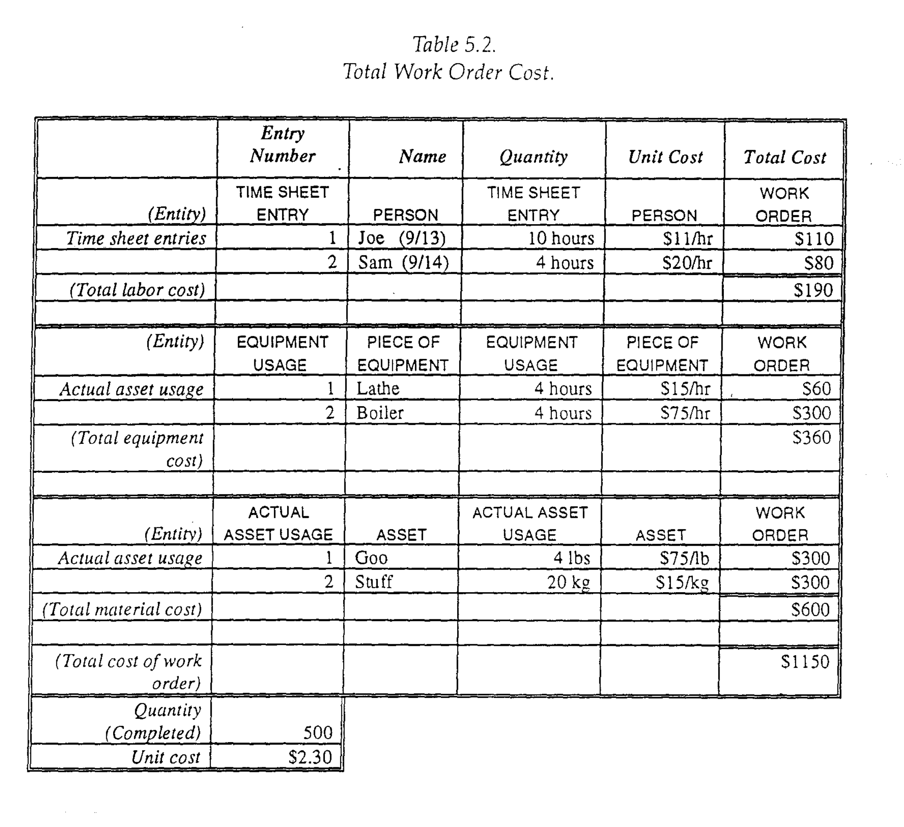
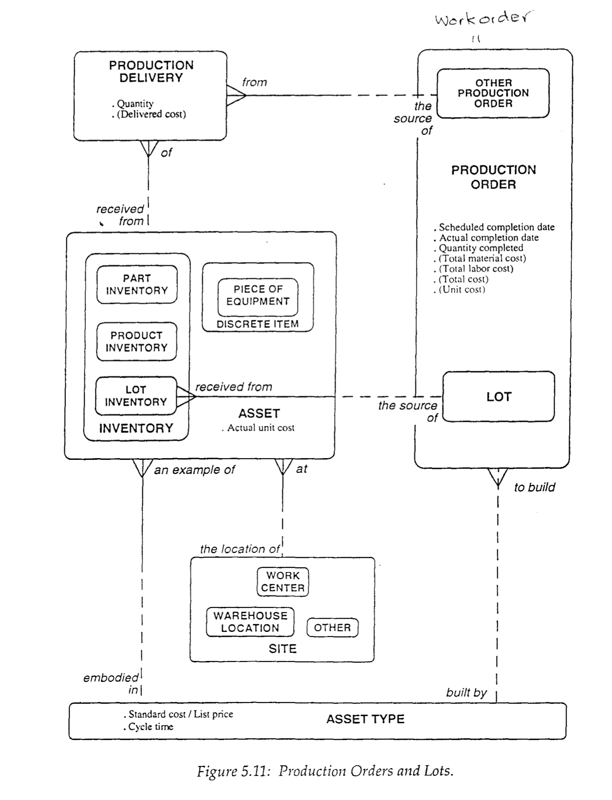
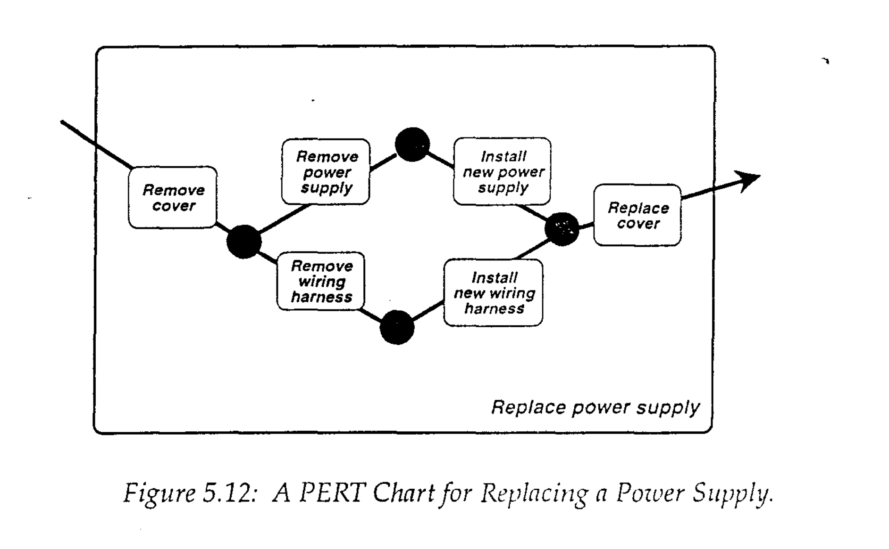
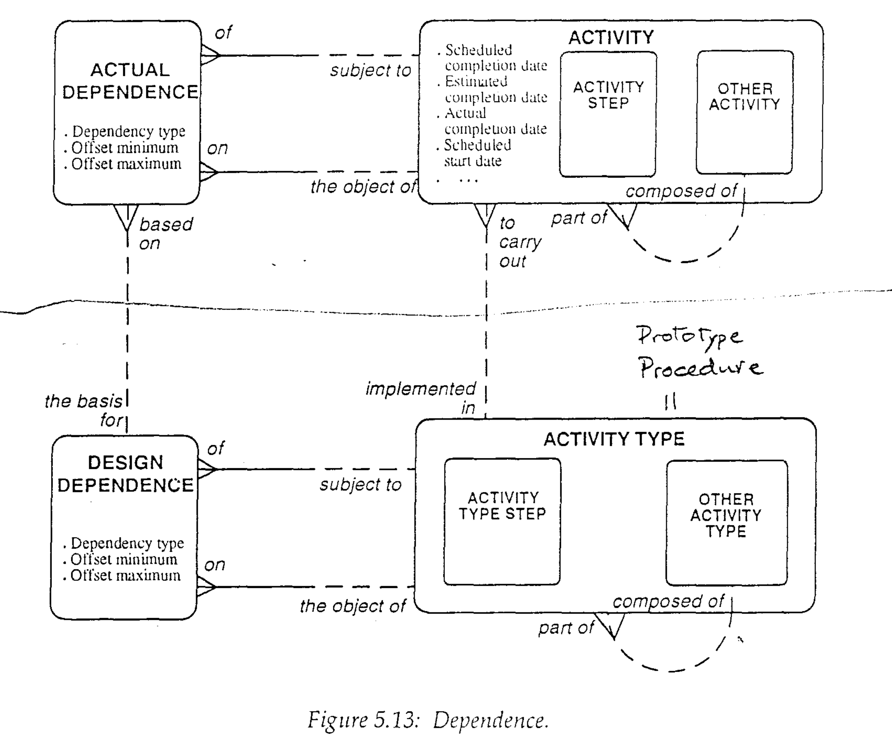

# PROCEDURES AND ACTIVITIES

这一章会建模这些服务，流程，行为。描述内部活动，工作订单。仍会描述相似性在不同的工作订单，为了维护，生产，项目管理等。
This chapter will model these services, procedures, and activities. It describes internal activities and work orders, along with the consumption of labor and materials by those activities and work orders. It also discusses the similarities among and differences between various kinds of work orders those for maintenance, production, project management, and responses to safety incidents.

## SOME DEFINITIONS

我们为啥要定义这些行为作为模型，这个和模型化函数不一样。相较于去描述什么将完成，我们可以用这个模型去展示活动，流程，服务，在业务中的意义，以及他们的相关项。
Understand, by the way, that when we model actions as entities, it is not the same thing as modeling actions as functions. Rather than using the model to describe the nature of what is being done,we can use it to show that activities,procedures, and services are themselves things of significance to the business,and that they are related as things to other things, For example, these activities, procedures, and services may be related to the people, organizations, and products discussed in the previous two chapters.

我们这一章的模板不是如此丰富的去描述这些行为，而仅仅定义这些需要的数据。
Our goal in this chapter is not so much to describe the actions themselves,but to identify the data required to describe them.

如果一个行为对外，可以叫服务，如果它仅是内部处理业务，可以叫程序。如果关注于项目管理，可以更抽象得称为活动类型。
As was the case with products, it is necessary to distinguish the definition of a service or procedure from examples of it. The definitions are represented by an entity that may variously be called SERVICE, ACTIVITY TYPE, or PROCEDURE. If the activity is sold to the outside, it is probably called SERVICE. If it is simply something done internally as part of doing business, it is a PROCEDURE. If the focus is on project management, it may be called more abstractly ACTIVITY TYPE.All three of these names refer to the definition of a set of steps that constitute a task. Attributes include "description," "expected duration," and so forth. For most of this chapter, we'll call the entity a PROCEDURE, but the other names would work as well.

The actual carrying out of a PROCEDURE is an ACTIVITY. Important attributes of an ACTIVITY are "scheduled start date," "scheduled end date," "actual start date," and so fort.

活动被程序所指向，一个程序可能实现一个或多个活动。这个图描画了一个组织关注于跟踪即兴的活动或者跟踪之前定义好的流程。如果仅关注的活动被之前定义的程序所执行，这个图就能改变去展示活动。
Figure 5.1 shows that an ACTIVITY may be to carry out a PROCEDURE, while a PROCEDURE may be implemented in one or more actual ACTIVITIES.This figure depicts an organization interested in keeping track of impromptu ACTIVITIES ----- as well as ones that are the execution of predefined PROCEDURES.If the only ACTIVITIES of interest were those to carry out predefined PROCEDURES, the diagram would have to be changed to show a solid line coming from ACTIVITY.That is,in some organizations, it might be more accurate to assert that each ACTIVITY must be to carry out a PROCEDURE.

## DIVIDING ACTIVITIES（切分活动）

组成流程的步骤的步骤。
Figure 5.2 shows two other aspects of activities: First, the steps that constitute the PROCEDURE may be called occurrences of PROCEDURE STEP,while the actual steps performed when the activity is carried out are occurrences of ACTIVITY STEP.That is, each ACTIVITY may be composed of one or more ACTIVITY STEPS,and each PROCEDURE may be composed of one or more PROCEDURE STEPS.

这适用于，若活动是十分清晰得定义在一个层级。当流程或活动可以被切分到更远，细化到子级。那就需要另一种方式了。
This is suitable when procedures and activities are clearly defined for only one level. When procedures or activities are divided into steps that are then divided further into substeps, and so forth,a second approach is needed, which is to divide each PROCEDURE into smaller PROCEDURES and each ACTIVITY into smaller ACTIVITIES.In Figure 5.2, for example, the pig's ear symbol on ACTIVITY shows that an ACTIVITY may be composed of one or more other ACTIVITIES,each of which in turn may be composed of yet more ACTIVITIES, and so forth.

A project(ACTIVITY)to build a house, for example, includes an ACTIVITY to lay the foundation,which may in turn encompass the ACTIVITIES of surveying the ground,putting in footings, and so forth. When it is modeled this way, the process can be extended indefinitely.

An ACTIVITY, then, either may be composed of one or more ACTIVITY STEPS (as described above) or may be composed of one or more other ACTIVITIES.

A corresponding pig's ear appears on PROCEDURE, showing that a PROCEDURE also either may be composed of one or more PROCEDURE STEPS, or may be composed of one or more other PROCEDURES. These component PROCEDURES may be broken down into successively smaller PROCEDURES. This way of breaking things down into progressively smaller pieces is shown in Figure 5.2.

注意，若一个活动由流程来执行，有理由相信活动步骤可能基于相符的流程步骤。比如，一个一次性的活动可以被永久的流程构造所实现，当然这最终取决于实际情况。
Note that in Figure 5.2, if an ACTIVITY is to carry out a PROCEDURE, it is reasonable to expect that an ACTIVITY STEP may be based on a corresponding PROCEDURE STEP. That is, the structure of a one-time activity may be derived from the permanent structure of the procedure it is implementing. Whether this is in fact so will depend on actual circumstances.

一个更加简洁的方式来呈现同样的配置在5.3。在这幅图里，一个活动步骤是活动的子类型，一个流程步骤是流程的子类型，每个流程可能被一个或多个流程组成，每个活动都由一个或多个活动组成。
A more compact way of showing this same configuration appears in Figure 5.3. In this drawing, an ACTIVITY STEP is a subtype of ACTIVITY, and PROCEDURE STEP is a subtype of PROCEDURE. Thus, each OTHER PROCEDURE may be composed of one or more PROCEDURES (either PEOCEDURE STEPS or OTHER PROCEDURES), and each OTHER ACTIVITY may be composed of one or more ACTIVITIES (either ACTIVITY STEPS or OTHER ACTITIES). This configuration allows each structure to go down as many levels as necessary. PROCEDURE STEP and ACTIVITY STEP are not required, but if they are specified, they can only be at the bottom of each respective structure .

要注意一个活动（或者活动步骤）可能仅是一个活动的部分。类似的，一个流程可能仅是一个其他流程的部分。
In Figure 5.3, we are asserting that each ACTIVITY (ACTIVITY STEP or OTHER ACTIVITY) may be part of one and only one OTHER ACTIVITY. Similarly, each' PROCEDURE (PROCEDURE STEP or OTHER PROCEDURE) may be part of one and only one OTHER PROCEDURE. In your organization, this may be true-but then again, it may not be. 

It is conceivable that a PROCEDURE STEP (such as "assemble the framis") might be part of more than one larger procedure (such as "fix the scrope" and "calibrate the flim-flam rods"). In that case, the part of /composed of relationships in Figures 5.2 and 5.3 would be "many-to-many," requiring the addition of intersect entities. This would be a "structure" entity, such as the GEOGRAPHIC STRUCTURE ELEMENT discussed in Chapter Three, or the ASSET TYPE STRUCTURE ELEMENT in Chapter Four. This is less common than the one-to-many version, however, so we shall not pursue it here.

## WORK ORDERS（工作顺序）

若工作用行为和程序来表示，那么支持这项工作的活动可以定义为工作顺序。一个工作顺序通常直接收入到文档里。工作顺序必须授权多个活动。注意，在一些组织里，一个活动可以执行但没有通过工作顺序授权。一个行为仅被一个工作顺序授权这是一个关系。你需要去决定这种关系是否需要强制执行。
While the work to be done is represented by ACTIVITIES and PROCEDURES, sponsorship of the work is represented by the entity WORK ORDER. (See Figure 5.4.) That is, a WORK ORDER is usually embodied in a document authorizing work to be done--the ACTIVITIES. A WORK ORDER may be the authorization for one or more ACTIVITIES. Note, however, that in some organizations, an activity may be carried out without being authorized by a work order. Hence, the relationship that each ACTIVITY may be authorized by one WORK ORDER. You will have to decide in your organization whether that relationship should be mandatory.

一个工作顺序必定由某人负责。
As with the ACTIVITIES it authorizes, a WORK ORDER may be composed of smaller WORK ORDERS, before ACTIVITIES are assigned to it. A WORK ORDER must be the responsibility of someone (usually a PERSON, but it could be an ORGANIZATION, so the relationship points to PARTY). It is probably prepared by a PERSON as well.

在工作顺序内的授权被实践以实现工作顺序的目的。显而易见，工作顺序可以被多个流程执行。
The authorization embodied in a WORK ORDER is exercised to fulfill the WORK ORDER'S purpose. Typically, the wORK ORDER may be defined to carry out one or more PROCEDURES, to make an ASSET TYPE, or to fix, install, remove, or inspect a specific PIECE OF EQUIPMENT. A PROCEDURE implemented by a WORK ORDER may itself be defined to fix, install, remove, or inspect an ASSET TYPE (which is most likely a PART /EQUIPMENT TYPE).

In addition to "work order number," "order quantity," and "order date," attributes of WORK ORDER might include "expected start date," "actual start date," "expected end date," "actual end date," and so forth.

## LABOR USAGE（劳工消耗）

人在独立的活动和工作顺序里扮演不同的角色。可能有管理人员，技术角色。
PEOPLE (and ORGANIZATIONS too, for that matter) play different roles in both individual ACTIVITIES and WORK ORDERS as a whole. These could be administrative roles (such as project secretary), or technical roles (such as chief engineer). There are several ways to represent this, as shown in Figure 5.5: A PARTY may be given one or more WORK ORDER ROLES in a WORK ORDER. Each WORK ORDER ROLE, then, is played by a PARTY in a WORK ORDER. Each WORK ORDER ROLE must be defined by a WORK ORDER ROLE TYPE, such as "project manager."

或者，规划好的工作顺序的活动，party可能给予特定的活动任务于活动。每个活动任务，是party的一个活动。每个活动任务必定是活动任务类型来定义的，比如统计。
Alternatively, as the ACTIVITIES within a wORK ORDER are being planned, a PARTY could be given a specific ACTIVITY ASSIGnMENT to an ACTIVITY (an ACTIVITY STEP or an OTHER ACTIVITY). Each ACTIVITY ASSIGNMENT, then, is of a PARTY to an ACTIVITY. Each ACTIVITY ASSIGNMENT must be defined by an ACTIVITY ASSIGNMENT TYPE, such as "statistician."

在大多数情况,工作顺序角色和行动任务一般都是一个人。组织也有可能参与到活动中来。保守的联系工作顺序角色和活动任务见图5.5.
In most cases, these WORK ORDER ROLES and ACTIVITY ASSIGNMENTS will be about a PERSON. ORGANIZATIONS (such as subcontractors) can also participate in WORK ORDERS and ACTIVITies, however. So, the more conservative approach is to link WORK ORDER ROLES and ACTIVITY ASSIGNMEnt to PARTY, as is depicted in Figure 5.5.

工作顺序角色和活动任务的区分点在工作顺序角色与party产生联系，贯穿工作顺序的生命周期。一个活动任务，另一方面来说，描述了party执行单一活动集的角色。
The difference between a WORK ORDER ROLE and an ACTIVITY ASSIGNMENT is that WORK ORDER ROLE has the connotation that a PARTY will do something through out the life of the WORK ORDER. An ACTIVITY ASSIGNMENT, on the other hand,describes the fact that a PARTY performs a set of actions for a single ACTIVITY only.

Both ACTIVITY ASSIGNMENT and WORK ORDER ROLE have such attributes as "start date," "end date," and so forth.

如果角色和负责人用于安排劳动，时间表格是我们用来记录这个人真实活动消耗时间的机制。我们假设时间表格是由人提交确认的，大多数情况如此
If roles and assignments are used to plan for labor usage, TIME SHEET ENTRY is the mechanism we'll use to record the actual hours worked by a PERSON and charged to either a WORK ORDER ROLE, a WORK ORDER (without a preassigned WORK ORDER ROLE), an ACTIVITI' ASSIGNMENT, or an ACTIVITY (where there was not an ACTIVITY ASSIGNMENT). For the sake of this example, we will assert that TIME SHEET ENTRIES are submitted by a PERSON, not a PARTY, since normally that is the case. It is not impossible that you may encounter a situation where time sheets are submitted by an organization, but this is rare.

the primary attribute of interest in a TIME SHEET ENTRY is "hours worked,"submitted by the PERSON,
charged to the ACTIVITY,WORK ORDER,or whatever.

若有负责单价这个属性需要人员提交到时间表格，那就需要乘以已工作时间在消耗这个元素。总计所有的时间表格里的时间消耗就是劳动消耗。
If "charge rate" is an attribute of the PERSON submitting a TIME SHEET ENTRY, this can be multiplied by the "hours worked" shown on it to arrive at the "cost,"a derived attribute of that TIME SHEET ENTRY. (Note that on the diagrams, derived attributes are shown in parentheses.) The sum of these for all TIME SHEET ENTRIES for the ACTIVITY(or ACTIVITY ASSIGNMENT,or whatever) is the "labor cost" (another derived attribute) of that ACTIVITY. This can be added to the "labor cost" of all other ACTIVITIES for the WORK ORDER,in order to arrive at the latter's "total labor cost."

显而易见，如果这里有活动步骤，那么统计劳工消耗就能在工作顺序里的劳动消耗前统计。可选方案是，如果时间表格如果直接由工作顺序负责，那么活动部分的计算就能跳过了。
Obviously, if there are ACTIVITY STEPS,they would be summarized into their ACTIvity"s "labor cost" before being made part of the WORK ORDER'S "total labor cost." Alternatively, if the TIME SHEET ENTRY is charged directly to the WORK ORDER,the ACTIVITY part of the calculation would be bypassed.

举个例子，如果某人时新35美金，时间表格对某一特定的工作记录为28小时，那么此时间表记录的花费金额是980。如果其他的时间表里的花费金额是10270，那么这个工作顺序的总计花费是11250.
For example, if a PERSON'S "charge rate" were $35 per hour, and the "hours worked" in a TIME SHEET ENTRY for a specific WORK ORDER were "28," the "cost" of ' that TIME SHEET ENTRY would be $980.ENTRIES charged to the WORK ORDER were the WORK ORDER would be $11,250.If the "cost" of all other TIME SHEET $10,270, then the "total labor cost" for the WORK ORDER would be $11,250.

## ACTUAL ASSET USAGE

如果时间表格记录了工作顺序的劳动时间。那么在工作顺序消耗的原材料可以被固定资产消耗所记录。
if TIME SHEET ENTRY is the labor time spent on a word order.the materials used in the WORK ORDER are recorded in ACTUAL ASSET USAGE (See Figure 5.7.) An ACTUAL ASSET USAGE may be charged to either an ACTIVITY or to the WORK ORDEr as a whole.

The ACTUAL ASSET USAGE may be either of an identified ASSET(such as a particular PIECE OF EQUIPMENT-a kind of DISCRETE ITEM-Or something from part INVENTORY),or it may be simply of an ASSET TYPE(such as "natural gas"). The ACTUAL ASSET USAGE must be expressed in a UNIT OF MEASURE, even if it is "each"-the unit of measure for items that are simply counted, rather than measured.

That is, if the part used is a major subassembly (a PIECE OF EQUIPMENT identified by a serial number), then ACTUAL ASSET USAGE is of that PIECE OF EQUIPMENT. If the part used is a product that is kept in quantity in PART INVENTORY,then the ACTUAL ASSET USAGE will be of the PART INVENTORY from which the parts were drawn. In both cases, ASSET defines the ASSET TYPE and SITE. If the ACTUAL ASSET USAGE is of a generic material, not kept in INVENTORY(such as natural gas from a tap), then the ACTUAL ASSET USAGE is of an ASSET TYPE(probably a MATERIAL TYPE).

无论哪种情况，这些消耗的单位都是需要被定义的，比如吧啦吧啦。单位消耗可以乘以数量，就得到了总花费。
In any of these cases, the unit cost of the item used is defined either as "actual unit cost" (an attribute of ASSET),or as either "list price" or "standard cost" (one of which would be an attribute of ASSET TYPE). This unit cost can then be multiplied by the "quantity" used in the corresponding occurrence of ACTUAL ASSET USAGE, to arrive at the "cost," a derived attribute of that occurrence.The "cost" of all ACTUAL ASSET USAGES can then be added together to compute the "total material cost" of the ACTIVITY(a derived attribute), which in turn may be summed across ACTIVITIES to arrive at the derived attribute of the WORK ORDER "total material cost."

As an example of these calculations, consider an ACTUAL ASSET USAGE of the MATERIAL WPE "Whimsite" in which the "quantity" (in pounds) is 30 and tne "list price" is 523. The "cost" then, of the aCTuAL ASSET USAGE is 5690 (523 multiplied by 30). If all other ACTUAL ASSET USAGE is charged to a WORK ORDER total $6,024, then the WORK ORDER "total material cost" is $6,714. Note that the ACTUAL ASSET USAGE may be based on an ASSET TYPE STRUCTURE ELEMENT; that is, the product being used may be one that was specified. Policy (the business rule) on this will vary from company to company and from situation to situation. In some cases, it may be required that no product can be used in a work order unless it is specified in the bill of materials for the item being worked on. ("Each ACTUAL ASSET USAGE must be based on one ASSET TYPE STRUCTURE ELEMENT." Figure 5.7 could be modified to show this by adding a solid line in the upper half of the relationship from ACTUAL ASSET USAGE to ASSET TYPE STRUCTURE ELEMENT.) Other situations may be more relaxed, as is shown with a complete dashed line in Figure 5.7

Note the parallel between this and the way a WORK ORDER'S "total labor cost" was computed, above. With "total labor cost" and "total material cost,"we can now compute the "total cost" (another derived attribute of WORK ORDER) as the sum of the two.

To take an example, a WORK ORDER might incur the costs shown in Table 5.1:

## Asset Structure

In Figure 4.12 and its accompanying text, the ASSET STRUCTURE ELEMENT was defined as the fact that one ASSET is a component of another ASSET. A modified version of this is reproduced as part of Figure 5.8

注意，若你画一条线从工作顺序到固定资产消耗再到资产，这个圈类似资产构造元素。事实上，一个工作顺序去维护，安装，删除，监测一个独立的资产可能需要另一固定资产的消耗，这就描述了一个事实，第二个资产可能是第一个资产的资产构造元素。唯一的区别是，工作顺序，固定资产消耗描述的是安装整个组件的行为，不是物理上的存在。
Note that if you draw a line from DISCRETE ITEM through WORK ORDER and then through ACTUAL ASSET USAGE to ASSET, this cycle is functionally equivalent to the ASSET STRUCTURE ELEMENT. That is, the fact that a WORK ORDER to fix, install,remove, or inspect a DISCRETE ITEM (an ASSET) may be charged with an ACTUAL ASSET USAGE of another ASSET, describes the fact that the second ASSET may be a component in an ASSET STRUCTURE ELEMENT that is in the first ASSET (in this case, a DISCRETE ITEM). The only difference is that the WORK ORDER/ACTUAL ASSET USAGE combination describes the act of installing the component (including the date
done and any labor used, for example) not just its physical presence.

The ASSET STRUCTURE ELEMENT does allow for the description of the composition of INVENTORY, which the WORK ORDER/ ACTUAL ASSET USAGE configuration does not.

## KINDS OF WORK ORDERS

Different kinds of WORK ORDERS are used to produce different kinds of things. For this reason, their models are not identical. They are very similar, however A MAInTENANCE WORK ORDER, for example, produces working equipment. A PRODUCTION ORDER produces a product or quantity of material for sale. A PROJECT produces a building or other large-scale result. A WORK ORDER may also bE issued to respond to an accident or some other safety incident. It is possible tc imagine other kinds of WORK ORDERS as well.

These differences may be seen in the models that follow: a MAINTENANCE WORK ORDER is to fix, install, remove, or inspect a DISCRETE ITEM. (See Figure 5.9.) A PRODUCTION ORDER, on the other hand, is to make an ASSET TYPE, resulting in OnE or more PRODUCTION DELIVERIES either of a DISCRETE ITEM or of an INVENTORY (seE Figure 5.10). In addition, it is usually of interest to keep track of a PRODUCTIOn ORDER through a plant, from work CENTER to WORK CENTER, while a MAINTENANCE WORK ORDER usually is not kept track of the same way. A PROJECT (such as a construction project), like a PRODUCTION ORDER, also makes something, but there is not necessarily an ASSET TYPE describing it in advance, and it is not usu ally as concerned with the progression of work from WORK CENTER to WORK CENTER." Its view of the way tasks are related to each other, however, is more complex, as we shall see when we get to Figure 5.13.

The kinds of WORK ORDERS to be discussed in the following sections are

+ Maintenance维护任务
+ Production (manufacturing) 制造
+ Large projects 大型项目
+ Emergency (responses to safety incidents)

In addition, Chapter Six will describe services offered to customers under contract.

### Maintenance Work Orders

维护工作有四种类型，检测，预检修，紧急维护，预防维护。
The model of MAINTENANCE WORK ORDERS is similar in structure to what we've seen so far, with some variations. Usually drawn up either to fix something,or to prevent it from failing, a MAINTENANCE WORK ORDER may also be used to order the installation or removal of something, or to respond to an emergency. Figure 5.9 shows how, as with other WORK ORDERS, each MAINTENANCE WORK ORDER may be to carry out a single PROCEDURE or may be the authorization for one or more ACTIVITIES,each of which is to carry out a PROCEDURE. There are four types of MAINTENANCE WORK ORDERS: inspections, predictive maintenance work orders, emergency work orders, and preventive maintenance work orders.

The first of these is a WORK ORDER to authorize an INSPECTION-a diagnostic examination of a PIECE OF EQUIPMENT. An INSPECTION will probably require some labor time (TIME SHEET ENTRIES),but usually no ACTUAL ASSET USAGE. An INSPECTION may be the trigger of one or more PREDICTIVE WORK ORDERS.

预检修是为了处理检测发现的问题。
The second type, a PREDICTIVE WORK ORDER, is issued to resolve a potential problem that has been diagnosed from an INSPECTION. That is, measurements taken from a PIECE OF EQUIPMENT may indicate that a particular part is wearing out and is due for replacement. Each PREDICTIVE WORK ORDER must be triggered by an INSPECTION.

紧急维护
An EMERGENCY WORK ORDER is the third kind of MAINTENANCE WORK ORDER.It is issued when something in the plant fails. It is the authorization to fix whatever is broken-and do it quickly! It is usually initiated by a call from a PERSON. Key attributes are "problem description" and "disposition." In this case,the PROCEDURES that are implemented in the EMERGENCY WORK ORDER are emergency procedures set up to deal with dangerous situations. EMERGENCY WORK ORDERS are discussed further in the discussion of safety-related incidents, below.

第四种预防维护，是定期任务。
The fourth type, a PREVENTIVE MAINTENANCE WORK ORDER,authorizes work to be performed according to a schedule (every three months or every six months, for example). Like other MAINTENANCE WORK ORDERS,it is the authorization for one or more ACTIVITIES,each the execution of a particular PROCEDURE. Each PROCEDURE implemented have the attribute in a PREVENTIVE MAINTENANCE WORK ORDER,* however, must have the attribute "cycle time"-the time expected between occurrences of the word."schedule start date," an attribute of MAINTENANCE WORK ORDER, has special significance.Typically, the next PREVENTIVE MAINTENANCE WORK ORDER time expected between occurrences of the will be set up when the current one is completed, with the "scheduled start date" set to the "actual end date" of the last PREVENTIVE MAINTENANCE WORK ORDER,plus the" cycle time" of the PROCEDURES the MAINTENANCE WORK ORDER is to carry out.

As with other WORK ORDERS,MAINTENANCE WORK ORDERS may be charged with ACTUAL ASSET USAGES,and may be charged with TIME SHEET ENTRIES. "Total material cost," "total labor cost," and "total cost" may be derived as previously described and portrayed in Figures 5.6 and 5.7.

### Production Orders（制造业）

When the work to be done is the manufacture of a company's products, the model changes somewhat, although it retains much of the same pattern as that for maintenance.

在维护和生产工作流里的两点主要区别，一是生产关注于对象的影响，和对象的地址。
The two primary differences between MAINTENANCE WORK ORDERS and PRODUCTION ORDERS concern the objectives of the effort, and the return of SITE, which we introduced in Chapter Three. Some names change as well.

我们重命名工作流到生产流，生产固定资产。
in Figure 5.10, we've renamed WORK ORDER to PRODUCTION ORDER, and its objective, instead of being to fix, install, remove, or inspect a PIECE OF EQUIPMENT,is to make an ASSET TYPE. Upon completion, a PRODUCTION ORDER may be the source of one or more PRODUCTION DELIVERIES of an ASSET. The PRODUCTION ORDER might produce DISCRETE ITEMS or additions to INVENTORY.

把活动重命名为制造步骤继续基础的活动。在制造活动中，每个活动的地址仅表示单独的一工作项被创造出的地址。伴随着制造顺序，这个地址似乎很重要，的确，这个地址很可能就是工厂或者工作中心。
To better reflect the language of the typical manufacturing plant, we have taken modeler's license and changed the name of ACTIVITY to MANUFACTURING STEP,and extended the basic model to show where each step will be performed in the plant. In the model of MAINTENANCE WORK ORDERS,the SITE of each activity is present only as the location of the DISCRETE ITEM being worked on. It may be included on the model, but it often is not required. With PRODUCTION ORDERS, however, the SITE becomes more important. In particular, a category of SITE,the WORK CENTER,is a manufacturing point in the factory. 

实际上，建模基于现实需要。在一些方案里，工作中心不是那么重要。
Actually, the organization being modeled will determine whether true. In some plants, WORK CENTERS may not be important. The plant also determines whether a MANUFACTURING STEP must be to carry out a predefined PROCEDURE. In highly controlled industries like pharmaceuticals, this would be so, but in others, the knowledge of a craftsman, rather than published procedures, may be the source of the step. Figure 5.10 takes this more craft-oriented view that each MANUFACTURING STEP may be to carry out a PROCEDURE。

通常，制造的顺序是提前定义好的,目的在于工作中心（每个生产顺序都必须被访问）。实施上，一个资产类型通常会在一种被称为routing step的工作中心被处理。每个routing step必定处理一种特殊的资产类型，并发生在特定的工作中心。这个routing step可能作为一个或多个制造顺序的基础。见图5.10。举个例子，批量生产墨水的企业，一个routing step放置了批量的10号蓝色墨水和23号墨水瓶。第一步就是组合这些，第二步就是静置20分钟，以此类推。
Normally, the manufacturing sequence is defined in advance, in terms of the WORK CENTERS that a PRODUCTION ORDER must visit. The fact that an ASSET TYPE is normally processed in a particular WORK CENTER is called a ROUTING STEP. That is, each ROUTING STEP must be to make a particular ASSET TYPE, and this take place at a particular work center.this routing step then may be the basic for one or more actual manufacturing steps that are part of production orders.Figure 5.10 show this.for example,in the manufacturing of a batch of printer's ink,a routing step places the batch of #10 blue is vessel 23.the first manufacturing step is to combine ingredients;the second is to stir for twenty minutes;and so forth.

一种更加常见的模型，会把ROUTING STEPS分组成ROUTINGS。因此每种资产类型可能由1个或多个ROUTINGS来制造。这就允许为了构建相同的产品而可选择不同的ROUTINGS。在任意的情况下，相同的资产也可选不同的工作中心来制造。这些都可以被控制通过声明相同的步骤编号给多个ROUTING STEPS。
A more sophisticated model than that shown would group ROUTING STEPS into ROUTINGS,so that each ASSET TYPE may be made via one or more ROUTINGS(sets of ROUTING STEPS), each of which is composed of one or more ROUTING STEPS. This allows for alternative ROUTINGS for building the same product. In either case, the same ASSET TYPE may be made in more than one WORK CENTER as alternatives, rather than as a sequence of steps. This could be controlled by assigning the same "step number" to multiple ROUTING STEPS。

Each MANUFACTURING STEP, then, either must be at a SITE (usually a WORK CENTER,but in some companies, it is conceivable that larger SITES may have to be identified), or it must be based on a ROUTING STEP(that identifies a WORK CENTER/SITE).

As with MAINTENANCE WORK ORDERS, labor usage by a PRODUCTION ORDER may be recorded via TIME SHEET ENTRIES,charged to either individual MANUFACTURING STEPS,or to the PRODUCTION ORDER as a whole. Calculation of "total labor
cost" for the PRODUCTION ORDER is then done as was shown in Figure 5.6. In most organizations, however, production roles need not be defined in advance,so the WORK ORDER ROLE entity usually disappears from the production model.Activity Assignment could be appropriate in certain manufacturing environments,but,to keep the diagram manageable,the entity and time sheet entry have been left off figure5.10.

a production order certainly consumes raw materials.when we model a manufacturing plant,we may rename Actual Asset Usage as Actual Part Usage or Actual Material Usage,depending on what is being manufactured.Structurally, however, the ACTUAL.... USAGE remains as described earlier. Consumption may be recorded for individual MANUFACTURING STEPS or for the PRODUCTION ORDER as a whole. That is, each ACTUAL ASSET USAGE must be either charged to one and only one PRODUCTION ORDER, or charged to one and only one MANUFACTURING STEP. Since the calculation of "total material cost" for the PRODUCTION ORDER is shown in Figure 5.7, it has been left off Figure 5.10.

As before, consumption may be recorded either of a physical ASSET-a DISCRETE ITEM or a quantity from INVENTORY-Or of a quantity of unspecified products described as an ASSET TYPE(such as natural gas).

In addition to the consumption of labor and materials, MANUFACTURING STEPSin a PRODUCTION ORDER may also explicitly make use of one or more PIECES OF EQUIPMENT. Since each PIECE OF EQUIPMENT may also be used in one or more MANUFACTURING STEPS,it is necessary to define the entity EQUIPMENT USAGE. This enhancement is shown in Figure 5.10, where the diagram shows EQUIPMENT USAGE as the fact that a particular PIECE OF EQUIPMENT has been used in a particular MANUFACTURING STEP. That is, each MANUFACTURING STEP may be charged with one or more EQUIPMENT USAGES,each of which is of a particular PIECE OF EQUIPMENT. Conversely, each PIECE OF EQUIPMENT may be subject to one or more EQUIPMENT USAGES,where each of these must be charged to a MANUFACTURING STEP.

The cost of EQUIPMENT USAGE may be calculated the same way other costs are calculated: On Figure 5.10, the "charge rate" for a PIECE OF EQUIPMENT is multiplied by the "number of hours" of its EQUIPMENT USAGE, to produce a "cost" of the EQUIPMENT USAGE. The "cost" of all EQUIPMENT USAGES for a MANUFACTURING STEP can then be added together to produce the "equipment cost" for that MANUFACTURING STEP. Adding together the "equipment cost" for all MANUFACTURING STEPS in a PRODUCTION ORDER gives the "total equipment cost" for the PRODUCTION ORDER.

As an example, if 2 hours on a device ("number of hours" of EQUIPMENT USAGE) are used at $55 per hour ("charge rate" of PIECE OF EQUIPMENT), then "cost" for the EQUIPMENT USAGE is $110. If the sum of all other EQUIPMENT USAGES
for this MANUFACTURING STEP were $3,100, the "equipment cost" for the MANUFACTURING STEP would be $3,210. If the cost of all other MANUFACTURING STEPS for this PRODUCTION ORDER were $10,450, then the "total equipment cost" for thePRODUCTION ORDER would be 513,660.

The "total cost" of the PRODUCTION ORDER, then (and by extension, of other kinds of WORK ORDERS as well), has now been expanded to the sum of "total labor cost," "total material cost," and "total equipment cost." The "unit cost" of the PRODUCTION (or other WORK) ORDER is the "total cost" divided by the "quantity completed." If the "total cost" of the PRODUCTION ORDER is $15,000 and the "quantity completed" is 1,000 units, then the "unit cost" is $15

The example that ,vas presented in Table 5.1 is expanded in Table 5.2 to include this calculation of equipment usage and the delivery cost.

Note that EQUIPMENT USAGE refers to the use of a PIECE OF EQUIPMENT in the production process, not to its inclusion in the finished product, as is implied by ACTUAL ASSET USAGE. The two could be combined, however, if this distinction is not important. In that case, "number of hours" would be renamed something more generic, like "quantity," and "unit of measure" ("hours" or "pieces") would have to be added as an attribute, to qualify the "quantity."

While a PRODUCTION ORDER makes something according to the specifications of an ASSET TYPE, it actually delivers ASSETS. That is, it is the source of one or more PRODUCTION DELIVERIES of an ASSET. (This was shown in Figure 5.10.) Each PRODUCTION DELIVERY is of an ASSET from a PRODUCTION ORDER. It is the nature of the plant and the production process that will determine whether the ASSET delivered is INVENTORY, a PIECE OF EQUIPMENT, or another DISCRETE ITEM.

The" delivery cost" of the PRODUCTION DELIVERY is calculated as the "unit cost" of the PRODUCTION ORDER multiplied by the "quantity" of the PRODUCTION DELIVERY. If, in the example above, in which the "unit cost" of 1,000 completed units was $15, only 500 units are delivered to stock, the "delivery cost" of the PRODUCTION DELIVERY is 57,500 (515 times 500 units). In the example in Table 5.2, if the first delivery consists of 200 units of the 500 completed, it will have a "delivery cost" of 5460 (52.30 times 200).

In the pharmaceutical and chemical industries, PRODUCTION ORDERS are often called LOTS, a term we first saw in Chapter Four. One difference between that setting and the situation of other manufacturers is that each LOT INVENTORY must be received from only one LOT, so there is no need for the PRODUCTION DELIVERY entity. Each LOT, of course, may be the source of one or more LOT INVENTORIES. (See Figure 5.11.)

### Projects

Like PRODUCTION ORDERS, PROJECTS are often the source of a DELIVERY of an ASSET, but the ASSET is usually big, like a building or a bridge. Alternatively, a PROJECT may be simply to accomplish a specific goal, such as putting on a theatrical production. Interestingly enough, models of the various kinds of PROJECTS are not significantly different from the generic WORK ORDER model presented earlier in this chapter. A particular kind of PROJECT may vastly increase the number of occurrences of ACTIVITY /MANUFACTURING STEP, PART USAGE, or TIME SHEET ENTRY, but the fundamental meaning of these entities and their relationship to the WORK ORDER is unchanged.

Where PROJECTS are unique, however, is in their concern for the underlying structure of ACTIVITIES.

Previously, we discussed the decomposition of ACTIVITIES into progressively smaller ACTIVITIES, thereby creating what project managers call a "work breakdown structure." Modeled in Figures 5.2 and 5.3, this concept is an important part of project management. Similarly, as shown previously in the same figures, a PROCEDURE may be composed of one or more other PROCEDURES. In the context of projects, PROCEDURE will go by the more abstract name ACTIVITY TYPE.

A second important aspect of activity organization is the fact that one ACTIVITY or ACTIVITY TYPE may be required to be completed before another ACTIVITY or ACTIVITY TYPE is started. Figure 5.12, for example, contains a PERT chart that shows the sequence of steps required for the ACTIVITY TYPE "Replace power supply." The ACTIVITY TYPE "Replace power supply" is composed of

+ Remove cover
+ Remove power supply
+ Remove wiring harness
+ Install new power supply
+ Install new wiring harness
+ Replace cover

The PERT chart shows that "Remove cover" must be completed before starting either "Remove power supply" or "Remove wiring harness." Similarly, "Install new power supply" and "Install new wiring harness" must be completed before beginning to "Replace cover." In each case, the subsequent activity can be considered to be dependent upon the prior one.

一种依赖可以被应用到一对行为类型，或者说仅适用一种特殊的行为。一个设计依赖描述了行为类型之间的依赖。它描述了这样的事实不管什么行为类型要被实践，一个特定的行为必须在其之前或者之后。
A dependence may apply to a pair of ACTIVITY TYPES, or it may be true only for particular ACTIVITIES. A DESIGN DEPENDENCE is about the relationship between ACTIVITY TYPES. It expresses the fact that whenever a particular ACTIVITY TYPE is to be carried out, a specified ACTIVITY TYPE must precede or follow it. Figure 5.13 shows that each DESIGN DEPENDENCE must be of one ACTIVITY TYPE on another, and each ACTIVITY TYPE may be subject to a DESIGN DEPENDENCE on another ,ACTIVITY TYPE. (The first cannot start until the second is complete.)

在我们的例子中，这个替换能源的行为类型包含六个行为类型。一个设计依赖在任何时间都区分开行为类型的先后，卸载电源依赖于卸载覆盖面，卸载线缆也依赖于卸载覆盖面。
In our example, the ACTIVITY TYPE "Replace power supply" consists of six ACTIVITY TYPES including, among others, "Remove cover" and "Remove power supply." (It is a matter of the terminology of the company involved whether the steps in the PERT chart represent ACTIVITY TYPE STEPS or simply OTHER ACTIVITY TYPES.) A DESIGN DEPENDENCE then dictates that any time the ACTIVITY TYPES are carried out, "Remove power supply" depends on (that is, must follow) "Remove cover," and another dictates that "Remove wiring harness" also depends on (must follow) "Remove cover."

An ACTUAL DEPENDENCE, on the other hand, is about the relationships between ACTIVITIES as they are expected actually to occur. It represents the fact that an ACTIVITY must happen before another ACTIVITY can be carried out. Figure 5.13 shows that an ACTUAL DEPENDENCE is of one ACTIVITY, on another ACTIVITY, so one actual ACTIVITY cannot be started before another is completed.