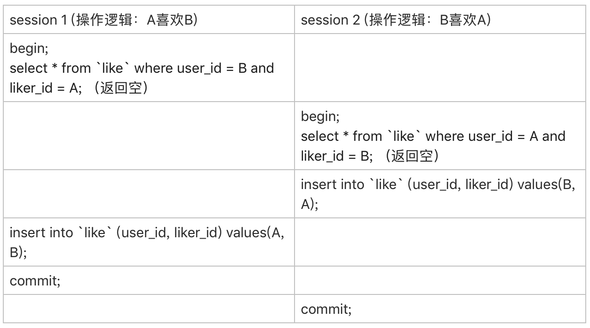

# 15 | 答疑文章（一）：日志和索引相关问题

## 日志相关问题

我在第 2 篇文章《日志系统：一条 SQL 更新语句是如何执行的？》中，和你讲到 binlog（归档日志）和 redo log（重做日志）配合崩溃恢复的时候，用的是反证法，说明了如果没有两阶段提交，会导致 MySQL 出现主备数据不一致等问题。

在这篇文章下面，很多同学在问，在两阶段提交的不同瞬间，MySQL 如果发生异常重启，是怎么保证数据完整性的？

我再放一次两阶段提交的图，方便你学习下面的内容。


这里，我要先和你解释一个误会式的问题。有同学在评论区问到，这个图不是一个 update 语句的执行流程吗，怎么还会调用 commit 语句？

他产生这个疑问的原因，是把两个“commit”的概念混淆了：

+ 他说的“commit 语句”，是指 MySQL 语法中，用于提交一个事务的命令。一般跟 begin/start transaction 配对使用。
+ 而我们图中用到的这个“commit 步骤”，指的是事务提交过程中的一个小步骤，也是最后一步。当这个步骤执行完成后，这个事务就提交完成了。
+ “commit 语句”执行的时候，会包含“commit 步骤”。

而我们这个例子里面，没有显式地开启事务，因此这个 update 语句自己就是一个事务，在执行完成后提交事务时，就会用到这个“commit 步骤“。

接下来，我们就一起分析一下在**两阶段提交的不同时刻，MySQL 异常重启会出现什么现象。**

如果在图中时刻 A 的地方，也就是写入 redo log 处于 prepare 阶段之后、写 binlog 之前，发生了崩溃（crash），由于此时 binlog 还没写，redo log 也还没提交，所以崩溃恢复的时候，这个事务会回滚。这时候，binlog 还没写，所以也不会传到备库。到这里，大家都可以理解。

大家出现问题的地方，主要集中在时刻 B，也就是 binlog 写完，redo log 还没 commit 前发生 crash，那崩溃恢复的时候 MySQL 会怎么处理？

我们先来看一下崩溃恢复时的判断规则。

1. 如果 redo log 里面的事务是完整的，也就是已经有了 commit 标识，则直接提交；
2. 如果 redo log 里面的事务只有完整的 prepare，则判断对应的事务 binlog 是否存在并完整：
    1. a.如果是，则提交事务；
    2. b. 否则，回滚事务。


这里，时刻 B 发生 crash 对应的就是 2(a) 的情况，崩溃恢复过程中事务会被提交。

现在，我们继续延展一下这个问题。

**追问 1：MySQL 怎么知道 binlog 是完整的?**

回答：一个事务的 binlog 是有完整格式的：

+ statement 格式的 binlog，最后会有 COMMIT；
+ row 格式的 binlog，最后会有一个 XID event。

另外，在 MySQL 5.6.2 版本以后，还引入了 binlog-checksum 参数，用来验证 binlog 内容的正确性。对于 binlog 日志由于磁盘原因，可能会在日志中间出错的情况，MySQL 可以通过校验 checksum 的结果来发现。所以，MySQL 还是有办法验证事务 binlog 的完整性的。

**追问 2：redo log 和 binlog 是怎么关联起来的?**

回答：它们有一个共同的数据字段，叫 XID。崩溃恢复的时候，会按顺序扫描 redo log：

+ 如果碰到既有 prepare、又有 commit 的 redo log，就直接提交；
+ 如果碰到只有 parepare、而没有 commit 的 redo log，就拿着 XID 去 binlog 找对应的事务。

**追问 3：处于 prepare 阶段的 redo log 加上完整 binlog，重启就能恢复，MySQL 为什么要这么设计?**

回答：其实，这个问题还是跟我们在反证法中说到的数据与备份的一致性有关。在时刻 B，也就是 binlog 写完以后 MySQL 发生崩溃，这时候 binlog 已经写入了，之后就会被从库（或者用这个 binlog 恢复出来的库）使用。

所以，在主库上也要提交这个事务。采用这个策略，主库和备库的数据就保证了一致性。

**追问 4：如果这样的话，为什么还要两阶段提交呢？干脆先 redo log 写完，再写 binlog。崩溃恢复的时候，必须得两个日志都完整才可以。是不是一样的逻辑？**

回答：其实，两阶段提交是经典的分布式系统问题，并不是 MySQL 独有的。

如果必须要举一个场景，来说明这么做的必要性的话，那就是事务的持久性问题。

对于 InnoDB 引擎来说，如果 redo log 提交完成了，事务就不能回滚（如果这还允许回滚，就可能覆盖掉别的事务的更新）。而如果 redo log 直接提交，然后 binlog 写入的时候失败，InnoDB 又回滚不了，数据和 binlog 日志又不一致了。

两阶段提交就是为了给所有人一个机会，当每个人都说“我 ok”的时候，再一起提交。

**追问 5：不引入两个日志，也就没有两阶段提交的必要了。只用 binlog 来支持崩溃恢复，又能支持归档，不就可以了？**

回答：这位同学的意思是，只保留 binlog，然后可以把提交流程改成这样：… -> “数据更新到内存” -> “写 binlog” -> “提交事务”，是不是也可以提供崩溃恢复的能力？

答案是不可以。

如果说历史原因的话，那就是 InnoDB 并不是 MySQL 的原生存储引擎。MySQL 的原生引擎是 MyISAM，设计之初就有没有支持崩溃恢复。

InnoDB 在作为 MySQL 的插件加入 MySQL 引擎家族之前，就已经是一个提供了崩溃恢复和事务支持的引擎了。

InnoDB 接入了 MySQL 后，发现既然 binlog 没有崩溃恢复的能力，那就用 InnoDB 原有的 redo log 好了。

而如果说实现上的原因的话，就有很多了。就按照问题中说的，只用 binlog 来实现崩溃恢复的流程，我画了一张示意图，这里就没有 redo log 了。


这样的流程下，binlog 还是不能支持崩溃恢复的。我说一个不支持的点吧：binlog 没有能力恢复“数据页”。

如果在图中标的位置，也就是 binlog2 写完了，但是整个事务还没有 commit 的时候，MySQL 发生了 crash。

重启后，引擎内部事务 2 会回滚，然后应用 binlog2 可以补回来；但是对于事务 1 来说，系统已经认为提交完成了，不会再应用一次 binlog1。

```
这里意思可以举个例子更直观，如：binlog1是update c+1;binlog2是update c+1;现在在binlog2写完没提交的时候发生crash,这时对数据的更新可能还停留在内存中，并未刷盘，crash后内存数据丢失。 由于binlog2事务为完成，系统会应用binlog2恢复数据，即此时c+1;但对于binlog1来说，已经完成了事务，系统不会再应用binlog1来恢复数据，所以数据c不会再+1. 这时数据c只加了一次，与未crash前c+了两次不同 即binlog没有能力恢复数据页
```

但是，InnoDB 引擎使用的是 WAL 技术，执行事务的时候，写完内存和日志，事务就算完成了。如果之后崩溃，要依赖于日志来恢复数据页。

也就是说在图中这个位置发生崩溃的话，事务 1 也是可能丢失了的，而且是数据页级的丢失。此时，binlog 里面并没有记录数据页的更新细节，是补不回来的。

你如果要说，那我优化一下 binlog 的内容，让它来记录数据页的更改可以吗？但，这其实就是又做了一个 redo log 出来。

所以，至少现在的 binlog 能力，还不能支持崩溃恢复。

**追问 6：那能不能反过来，只用 redo log，不要 binlog？**

回答：如果只从崩溃恢复的角度来讲是可以的。你可以把 binlog 关掉，这样就没有两阶段提交了，但系统依然是 crash-safe 的。

但是，如果你了解一下业界各个公司的使用场景的话，就会发现在正式的生产库上，binlog 都是开着的。因为 binlog 有着 redo log 无法替代的功能。

一个是归档。redo log 是循环写，写到末尾是要回到开头继续写的。这样历史日志没法保留，redo log 也就起不到归档的作用。

一个就是 MySQL 系统依赖于 binlog。binlog 作为 MySQL 一开始就有的功能，被用在了很多地方。其中，MySQL 系统高可用的基础，就是 binlog 复制。

还有很多公司有异构系统（比如一些数据分析系统），这些系统就靠消费 MySQL 的 binlog 来更新自己的数据。关掉 binlog 的话，这些下游系统就没法输入了。

总之，由于现在包括 MySQL 高可用在内的很多系统机制都依赖于 binlog，所以“鸠占鹊巢”redo log 还做不到。你看，发展生态是多么重要。

**追问 7：redo log 一般设置多大？**

回答：redo log 太小的话，会导致很快就被写满，然后不得不强行刷 redo log，这样 WAL 机制的能力就发挥不出来了。

所以，如果是现在常见的几个 TB 的磁盘的话，就不要太小气了，直接将 redo log 设置为 4 个文件、每个文件 1GB 吧。

**追问 8：正常运行中的实例，数据写入后的最终落盘，是从 redo log 更新过来的还是从 buffer pool 更新过来的呢？**

回答：这个问题其实问得非常好。这里涉及到了，“redo log 里面到底是什么”的问题。

实际上，redo log 并没有记录数据页的完整数据，所以它并没有能力自己去更新磁盘数据页，也就不存在“数据最终落盘，是由 redo log 更新过去”的情况。

1. 如果是正常运行的实例的话，数据页被修改以后，跟磁盘的数据页不一致，称为脏页。最终数据落盘，就是把内存中的数据页写盘。这个过程，甚至与 redo log 毫无关系。
2. 在崩溃恢复场景中，InnoDB 如果判断到一个数据页可能在崩溃恢复的时候丢失了更新，就会将它读到内存，然后让 redo log 更新内存内容。更新完成后，内存页变成脏页，就回到了第一种情况的状态。

**追问 9：redo log buffer 是什么？是先修改内存，还是先写 redo log 文件？**

回答：这两个问题可以一起回答。

在一个事务的更新过程中，日志是要写多次的。比如下面这个事务：

```sql
begin;
insert into t1 ...
insert into t2 ...
commit;
```

这个事务要往两个表中插入记录，插入数据的过程中，生成的日志都得先保存起来，但又不能在还没 commit 的时候就直接写到 redo log 文件里。

所以，redo log buffer 就是一块内存，用来先存 redo 日志的。也就是说，在执行第一个 insert 的时候，数据的内存被修改了，redo log buffer 也写入了日志。

但是，真正把日志写到 redo log 文件（文件名是 ib_logfile+ 数字），是在执行 commit 语句的时候做的。

（这里说的是事务执行过程中不会“主动去刷盘”，以减少不必要的 IO 消耗。但是可能会出现“被动写入磁盘”，比如内存不够、其他事务提交等情况。这个问题我们会在后面第 22 篇文章《MySQL 有哪些“饮鸩止渴”的提高性能的方法？》中再详细展开）。

单独执行一个更新语句的时候，InnoDB 会自己启动一个事务，在语句执行完成的时候提交。过程跟上面是一样的，只不过是“压缩”到了一个语句里面完成。

以上这些问题，就是把大家提过的关于 redo log 和 binlog 的问题串起来，做的一次集中回答。如果你还有问题，可以在评论区继续留言补充。

## 业务设计问题

接下来，我再和你分享 @ithunter 同学在第 8 篇文章《事务到底是隔离的还是不隔离的？》的评论区提到的跟索引相关的一个问题。我觉得这个问题挺有趣、也挺实用的，其他同学也可能会碰上这样的场景，在这里解答和分享一下。

问题是这样的（我文字上稍微做了点修改，方便大家理解）：

```quote
业务上有这样的需求，A、B 两个用户，如果互相关注，则成为好友。设计上是有两张表，一个是 like 表，一个是 friend 表，like 表有 user_id、liker_id 两个字段，我设置为复合唯一索引即 uk_user_id_liker_id。语句执行逻辑是这样的：

以 A 关注 B 为例：第一步，先查询对方有没有关注自己（B 有没有关注 A）select * from like where user_id = B and liker_id = A;

如果有，则成为好友insert into friend;

没有，则只是单向关注关系insert into like;

但是如果 A、B 同时关注对方，会出现不会成为好友的情况。因为上面第 1 步，双方都没关注对方。第 1 步即使使用了排他锁也不行，因为记录不存在，行锁无法生效。请问这种情况，在 MySQL 锁层面有没有办法处理？
```

```sql

CREATE TABLE `like` (
  `id` int(11) NOT NULL AUTO_INCREMENT,
  `user_id` int(11) NOT NULL,
  `liker_id` int(11) NOT NULL,
  PRIMARY KEY (`id`),
  UNIQUE KEY `uk_user_id_liker_id` (`user_id`,`liker_id`)
) ENGINE=InnoDB;

CREATE TABLE `friend` (
  `id` int(11) NOT NULL AUTO_INCREMENT,
  `friend_1_id` int(11) NOT NULL,
  `friend_2_id` int(11) NOT NULL,
  UNIQUE KEY `uk_friend` (`friend_1_id`,`friend_2_id`),
  PRIMARY KEY (`id`)
) ENGINE=InnoDB;
```

虽然这个题干中，并没有说到 friend 表的索引结构。但我猜测 friend_1_id 和 friend_2_id 也有索引，为便于描述，我给加上唯一索引。

我把他的疑问翻译一下，在并发场景下，同时有两个人，设置为关注对方，就可能导致无法成功加为朋友关系。

现在，我用你已经熟悉的时刻顺序表的形式，把这两个事务的执行语句列出来：



这个结果对业务来说就是 bug 了。因为在业务设定里面，这两个逻辑都执行完成以后，是应该在 friend 表里面插入一行记录的。

如提问里面说的，“第 1 步即使使用了排他锁也不行，因为记录不存在，行锁无法生效”。不过，我想到了另外一个方法，来解决这个问题。

首先，要给“like”表增加一个字段，比如叫作 relation_ship，并设为整型，取值 1、2、3。

```quote
值是 1 的时候，表示 user_id 关注 liker_id;值是 2 的时候，表示 liker_id 关注 user_id;值是 3 的时候，表示互相关注。
```

然后，当 A 关注 B 的时候，逻辑改成如下所示的样子：

如果A < B
```sql
mysql> begin; /*启动事务*/
insert into `like`(user_id, liker_id, relation_ship) values(A, B, 1) on duplicate key update relation_ship=relation_ship | 1;
select relation_ship from `like` where user_id=A and liker_id=B;
/*代码中判断返回的 relation_ship，
  如果是1，事务结束，执行 commit
  如果是3，则执行下面这两个语句：
  */
insert ignore into friend(friend_1_id, friend_2_id) values(A,B);
commit;
```

如果A > B

```sql

mysql> begin; /*启动事务*/
insert into `like`(user_id, liker_id, relation_ship) values(B, A, 2) on duplicate key update relation_ship=relation_ship | 2;
select relation_ship from `like` where user_id=B and liker_id=A;
/*代码中判断返回的 relation_ship，
  如果是2，事务结束，执行 commit
  如果是3，则执行下面这两个语句：
*/
insert ignore into friend(friend_1_id, friend_2_id) values(B,A);
commit;
```

这个设计里，让“like”表里的数据保证 user_id < liker_id，这样不论是 A 关注 B，还是 B 关注 A，在操作“like”表的时候，如果反向的关系已经存在，就会出现行锁冲突。

然后，insert … on duplicate 语句，确保了在事务内部，执行了这个 SQL 语句后，就强行占住了这个行锁，之后的 select 判断 relation_ship 这个逻辑时就确保了是在行锁保护下的读操作。

操作符 “|” 是按位或，连同最后一句 insert 语句里的 ignore，是为了保证重复调用时的幂等性。

这样，即使在双方“同时”执行关注操作，最终数据库里的结果，也是 like 表里面有一条关于 A 和 B 的记录，而且 relation_ship 的值是 3， 并且 friend 表里面也有了 A 和 B 的这条记录。

不知道你会不会吐槽：之前明明还说尽量不要使用唯一索引，结果这个例子一上来我就创建了两个。这里我要再和你说明一下，之前文章我们讨论的，是在“业务开发保证不会插入重复记录”的情况下，着重要解决性能问题的时候，才建议尽量使用普通索引。

而像这个例子里，按照这个设计，业务根本就是保证“我一定会插入重复数据，数据库一定要要有唯一性约束”，这时就没啥好说的了，唯一索引建起来吧。

