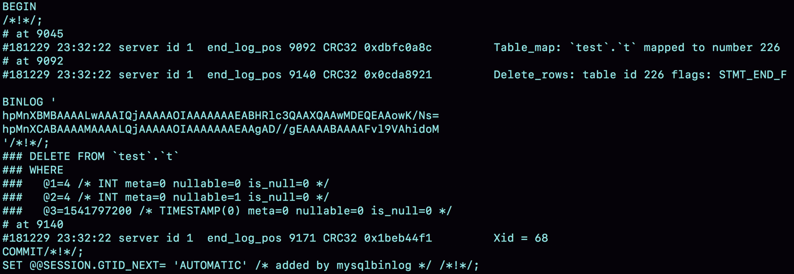

# 24 | MySQL是怎么保证主备一致的？

在前面的文章中，我不止一次地和你提到了 binlog，大家知道 binlog 可以用来归档，也可以用来做主备同步，但它的内容是什么样的呢？为什么备库执行了 binlog 就可以跟主库保持一致了呢？今天我就正式地和你介绍一下它。

在最开始，MySQL 是以容易学习和方便的高可用架构，被开发人员青睐的。而它的几乎所有的高可用架构，都直接依赖于 binlog。虽然这些高可用架构已经呈现出越来越复杂的趋势，但都是从最基本的一主一备演化过来的。

## MySQL 主备的基本原理


在状态 1 中，客户端的读写都直接访问节点 A，而节点 B 是 A 的备库，只是将 A 的更新都同步过来，到本地执行。这样可以保持节点 B 和 A 的数据是相同的。

当需要切换的时候，就切成状态 2。这时候客户端读写访问的都是节点 B，而节点 A 是 B 的备库。

在状态 1 中，虽然节点 B 没有被直接访问，但是我依然建议你把节点 B（也就是备库）设置成只读（readonly）模式。这样做，有以下几个考虑：

1. 有时候一些运营类的查询语句会被放到备库上去查，设置为只读可以防止误操作；
2. 防止切换逻辑有 bug，比如切换过程中出现双写，造成主备不一致；
3. 可以用 readonly 状态，来判断节点的角色。

你可能会问，我把备库设置成只读了，还怎么跟主库保持同步更新呢？

这个问题，你不用担心。因为 readonly 设置对超级 (super) 权限用户是无效的，而用于同步更新的线程，就拥有超级权限。

接下来，我们再看看节点 A 到 B 这条线的内部流程是什么样的。图 2 中画出的就是一个 update 语句在节点 A 执行，然后同步到节点 B 的完整流程图。


图 2 中，包含了我在上一篇文章中讲到的 binlog 和 redo log 的写入机制相关的内容，可以看到：主库接收到客户端的更新请求后，执行内部事务的更新逻辑，同时写 binlog。

备库 B 跟主库 A 之间维持了一个长连接。主库 A 内部有一个线程，专门用于服务备库 B 的这个长连接。一个事务日志同步的完整过程是这样的：

1. 在备库 B 上通过 change master 命令，设置主库 A 的 IP、端口、用户名、密码，以及要从哪个位置开始请求 binlog，这个位置包含文件名和日志偏移量。
2. 在备库 B 上执行 start slave 命令，这时候备库会启动两个线程，就是图中的 io_thread 和 sql_thread。其中 io_thread 负责与主库建立连接。
3. 主库 A 校验完用户名、密码后，开始按照备库 B 传过来的位置，从本地读取 binlog，发给 B。
4. 备库 B 拿到 binlog 后，写到本地文件，称为中转日志（relay log）。
5. sql_thread 读取中转日志，解析出日志里的命令，并执行。


这里需要说明，后来由于多线程复制方案的引入，sql_thread 演化成为了多个线程，跟我们今天要介绍的原理没有直接关系，暂且不展开。

分析完了这个长连接的逻辑，我们再来看一个问题：binlog 里面到底是什么内容，为什么备库拿过去可以直接执行。

## binlog 的三种格式对比

我在第 15 篇答疑文章中，和你提到过 binlog 有两种格式，一种是 statement，一种是 row。可能你在其他资料上还会看到有第三种格式，叫作 mixed，其实它就是前两种格式的混合。

为了便于描述 binlog 的这三种格式间的区别，我创建了一个表，并初始化几行数据。

```sql

mysql> CREATE TABLE `t` (
  `id` int(11) NOT NULL,
  `a` int(11) DEFAULT NULL,
  `t_modified` timestamp NOT NULL DEFAULT CURRENT_TIMESTAMP,
  PRIMARY KEY (`id`),
  KEY `a` (`a`),
  KEY `t_modified`(`t_modified`)
) ENGINE=InnoDB;

insert into t values(1,1,'2018-11-13');
insert into t values(2,2,'2018-11-12');
insert into t values(3,3,'2018-11-11');
insert into t values(4,4,'2018-11-10');
insert into t values(5,5,'2018-11-09');
```

如果要在表中删除一行数据的话，我们来看看这个 delete 语句的 binlog 是怎么记录的。

注意，下面这个语句包含注释，如果你用 MySQL 客户端来做这个实验的话，要记得加 -c 参数，否则客户端会自动去掉注释。

```sql

mysql> delete from t /*comment*/  where a>=4 and t_modified<='2018-11-10' limit 1;
```

当 binlog_format=statement 时，binlog 里面记录的就是 SQL 语句的原文。你可以用

```sql
mysql> show binlog events in 'master.000001';
```

命令看 binlog 中的内容。


1. 第一行 SET @@SESSION.GTID_NEXT='ANONYMOUS’你可以先忽略，后面文章我们会在介绍主备切换的时候再提到；
2. 第二行是一个 BEGIN，跟第四行的 commit 对应，表示中间是一个事务；
3. 第三行就是真实执行的语句了。可以看到，在真实执行的 delete 命令之前，还有一个“use ‘test’”命令。这条命令不是我们主动执行的，而是 MySQL 根据当前要操作的表所在的数据库，自行添加的。这样做可以保证日志传到备库去执行的时候，不论当前的工作线程在哪个库里，都能够正确地更新到 test 库的表 t。use 'test’命令之后的 delete 语句，就是我们输入的 SQL 原文了。可以看到，binlog“忠实”地记录了 SQL 命令，甚至连注释也一并记录了。
4. 最后一行是一个 COMMIT。你可以看到里面写着 xid=61。你还记得这个 XID 是做什么用的吗？如果记忆模糊了，可以再回顾一下第 15 篇文章中的相关内容。

为了说明 statement 和 row 格式的区别，我们来看一下这条 delete 命令的执行效果图：


可以看到，运行这条 delete 命令产生了一个 warning，原因是当前 binlog 设置的是 statement 格式，并且语句中有 limit，所以这个命令可能是 unsafe 的。

为什么这么说呢？这是因为 delete 带 limit，很可能会出现主备数据不一致的情况。比如上面这个例子：

1. 如果 delete 语句使用的是索引 a，那么会根据索引 a 找到第一个满足条件的行，也就是说删除的是 a=4 这一行；
2. 但如果使用的是索引 t_modified，那么删除的就是 t_modified='2018-11-09’也就是 a=5 这一行。

由于 statement 格式下，记录到 binlog 里的是语句原文，因此可能会出现这样一种情况：在主库执行这条 SQL 语句的时候，用的是索引 a；而在备库执行这条 SQL 语句的时候，却使用了索引 t_modified。因此，MySQL 认为这样写是有风险的。

那么，如果我把 binlog 的格式改为 binlog_format=‘row’， 是不是就没有这个问题了呢？我们先来看看这时候 binog 中的内容吧。


可以看到，与 statement 格式的 binlog 相比，前后的 BEGIN 和 COMMIT 是一样的。但是，row 格式的 binlog 里没有了 SQL 语句的原文，而是替换成了两个 event：Table_map 和 Delete_rows。

1. Table_map event，用于说明接下来要操作的表是 test 库的表 t;
2. Delete_rows event，用于定义删除的行为。

其实，我们通过图 5 是看不到详细信息的，还需要借助 mysqlbinlog 工具，用下面这个命令解析和查看 binlog 中的内容。因为图 5 中的信息显示，这个事务的 binlog 是从 8900 这个位置开始的，所以可以用 start-position 参数来指定从这个位置的日志开始解析。

```SQL

mysqlbinlog  -vv data/master.000001 --start-position=8900;
``` 



从这个图中，我们可以看到以下几个信息：

+ server id 1，表示这个事务是在 server_id=1 的这个库上执行的。
+ 每个 event 都有 CRC32 的值，这是因为我把参数 binlog_checksum 设置成了 CRC32。
+ Table_map event 跟在图 5 中看到的相同，显示了接下来要打开的表，map 到数字 226。现在我们这条 SQL 语句只操作了一张表，如果要操作多张表呢？每个表都有一个对应的 Table_map event、都会 map 到一个单独的数字，用于区分对不同表的操作。
+ 我们在 mysqlbinlog 的命令中，使用了 -vv 参数是为了把内容都解析出来，所以从结果里面可以看到各个字段的值（比如，@1=4、 @2=4 这些值）。
+ binlog_row_image 的默认配置是 FULL，因此 Delete_event 里面，包含了删掉的行的所有字段的值。如果把 binlog_row_image 设置为 MINIMAL，则只会记录必要的信息，在这个例子里，就是只会记录 id=4 这个信息。
+ 最后的 Xid event，用于表示事务被正确地提交了。

你可以看到，当 binlog_format 使用 row 格式的时候，binlog 里面记录了真实删除行的主键 id，这样 binlog 传到备库去的时候，就肯定会删除 id=4 的行，不会有主备删除不同行的问题。

## 为什么会有 mixed 格式的 binlog？

基于上面的信息，我们来讨论一个问题：为什么会有 mixed 这种 binlog 格式的存在场景？推论过程是这样的：

+ 因为有些 statement 格式的 binlog 可能会导致主备不一致，所以要使用 row 格式。
+ 但 row 格式的缺点是，很占空间。比如你用一个 delete 语句删掉 10 万行数据，用 statement 的话就是一个 SQL 语句被记录到 binlog 中，占用几十个字节的空间。但如果用 row 格式的 binlog，就要把这 10 万条记录都写到 binlog 中。这样做，不仅会占用更大的空间，同时写 binlog 也要耗费 IO 资源，影响执行速度。
+ 所以，MySQL 就取了个折中方案，也就是有了 mixed 格式的 binlog。mixed 格式的意思是，MySQL 自己会判断这条 SQL 语句是否可能引起主备不一致，如果有可能，就用 row 格式，否则就用 statement 格式。

**也就是说，mixed 格式可以利用 statment 格式的优点，同时又避免了数据不一致的风险。**

因此，如果你的线上 MySQL 设置的 binlog 格式是 statement 的话，那基本上就可以认为这是一个不合理的设置。你至少应该把 binlog 的格式设置为 mixed。

比如我们这个例子，设置为 mixed 后，就会记录为 row 格式；而如果执行的语句去掉 limit 1，就会记录为 statement 格式。

**当然我要说的是，现在越来越多的场景要求把 MySQL 的 binlog 格式设置成 row。这么做的理由有很多，我来给你举一个可以直接看出来的好处：恢复数据。**

接下来，我们就分别从 delete、insert 和 update 这三种 SQL 语句的角度，来看看数据恢复的问题。

通过图 6 你可以看出来，即使我执行的是 delete 语句，row 格式的 binlog 也会把被删掉的行的整行信息保存起来。所以，如果你在执行完一条 delete 语句以后，发现删错数据了，可以直接把 binlog 中记录的 delete 语句转成 insert，把被错删的数据插入回去就可以恢复了。

如果你是执行错了 insert 语句呢？那就更直接了。row 格式下，insert 语句的 binlog 里会记录所有的字段信息，这些信息可以用来精确定位刚刚被插入的那一行。这时，你直接把 insert 语句转成 delete 语句，删除掉这被误插入的一行数据就可以了。

如果执行的是 update 语句的话，binlog 里面会记录修改前整行的数据和修改后的整行数据。所以，如果你误执行了 update 语句的话，只需要把这个 event 前后的两行信息对调一下，再去数据库里面执行，就能恢复这个更新操作了。

其实，由 delete、insert 或者 update 语句导致的数据操作错误，需要恢复到操作之前状态的情况，也时有发生。MariaDB（mysql的分支） 的Flashback工具就是基于上面介绍的原理来回滚数据的。

虽然 mixed 格式的 binlog 现在已经用得不多了，但这里我还是要再借用一下 mixed 格式来说明一个问题，来看一下这条 SQL 语句：

```sql
mysql> insert into t values(10,10, now());
```

如果我们把 binlog 格式设置为 mixed，你觉得 MySQL 会把它记录为 row 格式还是 statement 格式呢？

先不要着急说结果，我们一起来看一下这条语句执行的效果。

.png)

可以看到，MySQL 用的居然是 statement 格式。你一定会奇怪，如果这个 binlog 过了 1 分钟才传给备库的话，那主备的数据不就不一致了吗？

接下来，我们再用 mysqlbinlog 工具来看看：


从图中的结果可以看到，原来 binlog 在记录 event 的时候，多记了一条命令：SET TIMESTAMP=1546103491。它用 SET TIMESTAMP 命令约定了接下来的 now() 函数的返回时间。

因此，不论这个 binlog 是 1 分钟之后被备库执行，还是 3 天后用来恢复这个库的备份，这个 insert 语句插入的行，值都是固定的。也就是说，通过这条 SET TIMESTAMP 命令，MySQL 就确保了主备数据的一致性。

**我之前看过有人在重放 binlog 数据的时候，是这么做的：用 mysqlbinlog 解析出日志，然后把里面的 statement 语句直接拷贝出来执行。**

你现在知道了，这个方法是有风险的。因为有些语句的执行结果是依赖于上下文命令的，直接执行的结果很可能是错误的。

所以，用 binlog 来恢复数据的标准做法是，用 **mysqlbinlog 工具解析出来，然后把解析结果整个发给 MySQL 执行。类似下面的命令：**

```sql

mysqlbinlog master.000001  --start-position=2738 --stop-position=2973 | mysql -h127.0.0.1 -P13000 -u$user -p$pwd;
```

这个命令的意思是，将 master.000001 文件里面从第 2738 字节到第 2973 字节中间这段内容解析出来，放到 MySQL 去执行。

## 循环复制问题

通过上面对 MySQL 中 binlog 基本内容的理解，你现在可以知道，binlog 的特性确保了在备库执行相同的 binlog，可以得到与主库相同的状态。

因此，我们可以认为正常情况下主备的数据是一致的。也就是说，图 1 中 A、B 两个节点的内容是一致的。其实，图 1 中我画的是 M-S 结构，但实际生产上使用比较多的是双 M 结构，也就是图 9 所示的主备切换流程。


对比图 9 和图 1，你可以发现，双 M 结构和 M-S 结构，其实区别只是多了一条线，即：节点 A 和 B 之间总是互为主备关系。这样在切换的时候就不用再修改主备关系。

但是，双 M 结构还有一个问题需要解决。

**业务逻辑在节点 A 上更新了一条语句，然后再把生成的 binlog 发给节点 B，节点 B 执行完这条更新语句后也会生成 binlog。（我建议你把参数 log_slave_updates 设置为 on，表示备库执行 relay log 后生成 binlog）。**

那么，如果节点 A 同时是节点 B 的备库，相当于又把节点 B 新生成的 binlog 拿过来执行了一次，然后节点 A 和 B 间，会不断地循环执行这个更新语句，也就是循环复制了。这个要怎么解决呢？

从上面的图 6 中可以看到，MySQL 在 binlog 中记录了这个命令第一次执行时所在实例的 server id。因此，我们可以用下面的逻辑，来解决两个节点间的循环复制的问题：

1. 规定两个库的 server id 必须不同，如果相同，则它们之间不能设定为主备关系；
2. 一个备库接到 binlog 并在重放的过程中，生成与原 binlog 的 server id 相同的新的 binlog；
3. 每个库在收到从自己的主库发过来的日志后，先判断 server id，如果跟自己的相同，表示这个日志是自己生成的，就直接丢弃这个日志。

按照这个逻辑，如果我们设置了双 M 结构，日志的执行流就会变成这样：

1. 从节点 A 更新的事务，binlog 里面记的都是 A 的 server id；
2. 传到节点 B 执行一次以后，节点 B 生成的 binlog 的 server id 也是 A 的 server id；
3. 再传回给节点 A，A 判断到这个 server id 与自己的相同，就不会再处理这个日志。所以，死循环在这里就断掉了。

## 小结

今天这篇文章，我给你介绍了 MySQL binlog 的格式和一些基本机制，是后面我要介绍的读写分离等系列文章的背景知识，希望你可以认真消化理解。

说到循环复制问题的时候，我们说 MySQL 通过判断 server id 的方式，断掉死循环。但是，这个机制其实并不完备，在某些场景下，还是有可能出现死循环。

上期我留给你的问题是，你在什么时候会把线上生产库设置成“非双 1”。我目前知道的场景，有以下这些：

1. 业务高峰期。一般如果有预知的高峰期，DBA 会有预案，把主库设置成“非双 1”。
2. 备库延迟，为了让备库尽快赶上主库。@永恒记忆和 @Second Sight 提到了这个场景。
3. 用备份恢复主库的副本，应用 binlog 的过程，这个跟上一种场景类似。
4. 批量导入数据的时候。

一般情况下，把生产库改成“非双 1”配置，是设置 innodb_flush_logs_at_trx_commit=2、sync_binlog=1000。

评论区留言点赞板：

```sql
@way 同学提到了一个有趣的现象，由于从库设置了 binlog_group_commit_sync_delay 和 binlog_group_commit_sync_no_delay_count 导致一直延迟的情况。我们在主库设置这两个参数，是为了减少 binlog 的写盘压力。备库这么设置，尤其在“快要追上”的时候，就反而会受这两个参数的拖累。一般追主备就用“非双 1”（追上记得改回来）。

@一大只 同学验证了在 sync_binlog=0 的情况下，设置 sync_delay 和 sync_no_delay_count 的现象，点赞这种发现边界的意识和手动验证的好习惯。是这样的：sync_delay 和 sync_no_delay_count 的逻辑先走，因此该等还是会等。等到满足了这两个条件之一，就进入 sync_binlog 阶段。这时候如果判断 sync_binlog=0，就直接跳过，还是不调 fsync。

@锅子 同学提到，设置 sync_binlog=0 的时候，还是可以看到 binlog 文件马上做了修改。这个是对的，我们说“写到了 page cache”，就是文件系统的 page cache。而你用 ls 命令看到的就是文件系统返回的结果。
```

## Q&A

1. 老师，我想问下双M架构下，主从复制，是不是一方判断自己的数据比对方少就从对方复制，判断依据是什么

+ 作者回复: 好问题。

一开始创建主备关系的时候， 是由备库指定的。
比如基于位点的主备关系，备库说“我要从binlog文件A的位置P”开始同步， 主库就从这个指定的位置开始往后发。


而主备复制关系搭建完成以后，是主库来决定“要发数据给备库”的。

所以主库有生成新的日志，就会发给备库。

2. 老师您好，读到您关于binlog的文章之后，我有个疑问。
我之前理解是，mysql 每执行一条事务所产生的binlog准备写到 binlog file时，都会先判断当前文件写入这条binlog之后是否会超过设置的max_binlog_size值。 如果超过，则rotate 自动生成下个binlog flie 来记录这条binlog信息。
那如果 事务所有产生的binlog 大于 max_binlog_size 值呢？ 那不是永久地rotate吗？ mysql是如何处理的？
谢谢。

+ 作者回复: 好问题

一个事务的binlog日志不会被拆到两个binlog文件，所以会等到这个事务的日志写完再rotate，所以你会看见超过配置大小上限的binlog 文件

3. 课后题。如果在同步的过程中修改了server id，那用原server id 生成的log被两个M认为都不是自己的而被循环执行，不知这种情况会不会发生

+ 作者回复: 是的，会

4. 老师，我想问下，如果一张表并没有主键，插入的一条数据和这张表原有的一条数据所有字段都是一样的，然后对插入的这条数据做恢复，会不会把原有的那条数据删除？不知道在没有主键的情况下binlog会不会也记录数据库为其生成的主键id

+ 作者回复: 好问题，
会删除一条，但确实可能删除到之前的那条。

主要就是因为，没有主键的时候，binlog里面就不会记录主键字段。

4. mysql做主从，一段时间后发现从库在高峰期会发生一两条条数据丢失（不记得是查询行空白还是查询不到了），主从正常，怎么判断？
1.我问他是不是所以从库都是一样，他说不一样
2.我说低峰期重做新的从库观察，查看日志有没有报错？他好像不满意这个答案。

二、他还问主库挂了怎么办？

1. mysql主从+keepalived/heartbeat
     有脑裂，还是有前面丢数据问题
2. 用MMM或HMA之类
3. 用ZK之类

三、写的压力大怎么办？
我回答，分库，分表

+ 第一个问题其实我也没看懂，“高峰期丢数据”是指主备延迟查不到数据，还是真的丢了，得先问清楚下
+ 不过你回答的第二点不太好，低峰期重做这个大家都知道要这么做，而且只是修复动作，没办法用来定位原因，面试官是要问你分析问题的方法（方向错误）
重搭从库错误日志里面什么都没有的（这个比较可惜，暴露了对字节不够了解，一般不了解的方法在面试的时候是不如不说的）
+ 第二个问题三点都是你回答的吗？那还算回答得可以的，但是不能只讲名词，要找个你熟悉细节的方案展开一下


